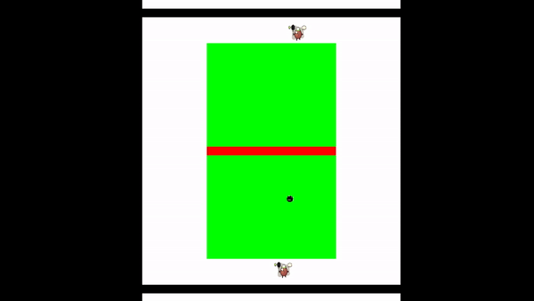
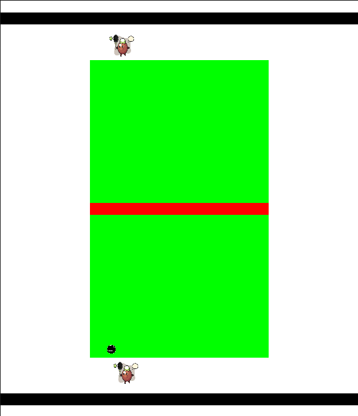
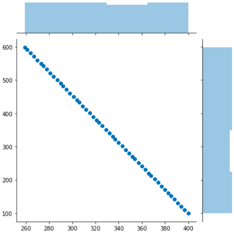

# A reinforcement learning based tennis game - Discrete mathematics approach

### An RL environment built using pygame

Watch on youtube below.

 [![Watch on youtube here]](https://youtu.be/iUYxZ2tYKHw)

------------------------------------------------------------------------------------------------------------------

## Playing the Game

------------------------------------------------------------------------------------------------------------------

------------------------------------------------------------------------------------------------------------------

###  Discrete mathematics approach

This uses the y = mx + c approach to forecast new ball locations

Below shows, Agent A, predicting coordinate (260, 600) from its present point (100, 400)

------------------------------------------------------------------------------------------------------------------

------------------------------------------------------------------------------------------------------------------

Below shows, Agent B, predicting coordinate (260, 600) from its present point (100, 400)

------------------------------------------------------------------------------------------------------------------

------------------------------------------------------------------------------------------------------------------

### To run program follow the process below:

pip install -r requirement.txt
